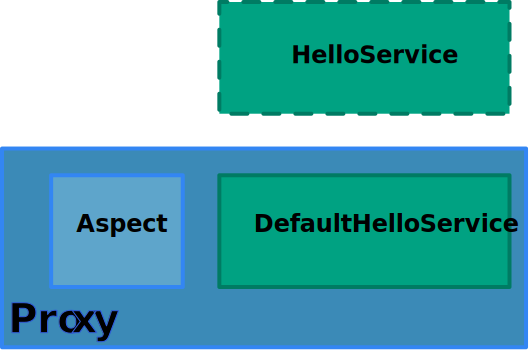

# Workshop Spring Core<br><br><i class="fa fa-leaf" aria-hidden="true"></i>Le conteneur

<!-- .slide: class="page-title" -->


## Sommaire

<!-- .slide: class="toc" -->

*   [Introduction](#/1)
*   **[Le conteneur](#/2)**
*   [Accès aux données](#/3)
*   [Le Web](#/4)
*   [Spring Boot](#/5)


## Modèle de programmation

*   POJO
    *   Code métier découplé de son environnement
    *   Beans
*   Environnement
    *   Connexion, transaction
*   Réutilisation et testabilité
*   AOP pour les problématiques transverses
    *   Notamment techniques


## Configuration Java

*   Assembler les composants d'une application
    *   repository, service, datasource, etc.
*   Injection de dépendances
*   Partie "Conteneur léger" de Spring


## Configuration Java

*   Les beans sont créés et injectés en Java
*   Permet d'ajouter de la logique facilement
*   Pas d'impact sur le code
*   Type-safe


## Nos classes

```java
public class JdbcUserRepository implements UserRepository {

  private final JdbcOperations tpl;

  public JdbcUserRepository(DataSource dataSource) {
    this.tpl = new JdbcTemplate(dataSource);
  }
  (...)
}

public class UserServiceImpl implements UserService {

  private UserRepository userRepository;  // setter défini

  private String digest;  // setter défini

  (...)

  public void init() { (...) } // méthode d'initialisation
}

```


## Configuration Java

```java
@Configuration // Déclaration classe de configuration
public class ApplicationConfiguration {

  @Bean public DataSource dataSource() { // Méthode déclarant un bean
    return new EmbeddedDatabaseBuilder()
      .setType(EmbeddedDatabaseType.H2)
      .addScript("classpath:/create-tables.sql")
      .addScript("classpath:/insert-data.sql")
      .build();
  }

  @Bean public UserRepository userRepository() {
    return new JdbcUserRepository(dataSource()); // Injection de dépendances
  }

  @Bean public UserService userService() {
    UserServiceImpl userService = new UserServiceImpl();
    userService.setDigest("sha-256");
    userService.setUserRepository(userRepository());
    userService.init(); // Callback d'initialisation à appeler
    return userService;
  }
}

```


## Configuration Java

*   Déclaration dans plusieurs classes

```java
@Configuration
@Import({InfraConfiguration.class,ComponentConfiguration.class})
public class ApplicationConfiguration { }
```

*   Évite des fichiers gros et monolithiques
*   Réutilisation (test, dev, prod)
*   Séparation par couche, module, applicatif/infra


## Configuration Java

*   Création, utilisation, destruction

```java
ConfigurableApplicationContext ctx = new AnnotationConfigApplicationContext(
    ApplicationConfiguration.class
);
UserService userService = ctx.getBean(UserService.class);
String login = "mmouse";
String password = "this is a test";
userService.create(login,password);
ctx.close();
```

*   Le bean est un singleton
    *   Notion de "scope"


## Possibilités

*   Configuration orientée objet

```java
@Configuration
public class SpringMvcConfiguration extends WebMvcConfigurationSupport {

	@Override
	protected void addInterceptors(InterceptorRegistry registry) {
		registry.addInterceptor(new MyInterceptor());
	}

}
```


<!-- .slide: class="page-questions" -->


## <i class="fa fa-pencil-square-o" aria-hidden="true"></i> TP : java-configuration-start

*   Configuration en Java
*   Test d'intégration


## Configuration XML

*   Solution historique de configuration
*   Permet d'assembler les composants d'une application
    *   Repository, service, datasource, etc
*   Injection de dépendances
*   Partie “conteneur léger” de Spring


## Nos classes

```java
public class JdbcUserRepository implements UserRepository {

  private final JdbcOperations tpl;

  public JdbcUserRepository(DataSource dataSource) {
    this.tpl = new JdbcTemplate(dataSource);
  }
  (...)
}

public class UserServiceImpl implements UserService {

  private UserRepository userRepository;  // setter défini

  private String digest;  // setter défini

  (...)

  public void init() { (...) } // méthode d'initialisation
}

```


## Configuration XML

```xml
<bean id="userRepository" class="c.z.repository.jdbc.JdbcUserRepository">
  <constructor-arg ref="dataSource" />
</bean>

<bean id="userService" class="c.z.business.impl.UserServiceImpl"
      init-method="init">
  <property name="digest" value="sha-256" />
  <property name="userRepository" ref="userRepository" />
</bean>
```


## Configuration XML

```xml
<bean id="userRepository" class="c.z.repository.jdbc.JdbcUserRepository">
  <constructor-arg ref="dataSource" />
</bean>
```

*   'id' pour pouvoir y faire référence
*   Attribut pour la classe d'implémentation
*   Injection par constructeur
*   Référence à un autre bean
    *   Attribut `Ref`
    *   Définition du `dataSource` expliquée par la suite


## Configuration XML

```xml
<bean id="userService" class="c.z.business.impl.UserServiceImpl"
      init-method="init">
  <property name="digest" value="sha-256" />
  <property name="userRepository" ref="userRepository" />
</bean>
```

*   Spring appelle al méthode d'initialisation
    *   Attribut `init-method`
*   Injection par setter
    *   Valeur scalaire, attribute `value`
    *   Bean Spring, attribut `ref`


## Configuration XML

*   Entête du fichier
    *   Cuisine XML

```xml
<?xml version="1.0" encoding="UTF-8"?>
<beans xmlns="http://www.springframework.org/schema/beans"
      xmlns:xsi="http://www.w3.org/2001/XMLSchema-instance"
       xsi:schemaLocation="http://www.springframework.org/schema/beans
         http://www.springframework.org/schema/beans/spring-beans.xsd">
 (...)
</beans>
```

*   Copier / coller ou support IDE


## Configuration XML

*   DataSource

```xml
<jdbc:embedded-database id="dataSource" type="H2">
  <jdbc:script location="classpath:/create-tables.sql" />
  <jdbc:script location="classpath:/insert-data.sql" />
</jdbc:embedded-database>
```

*   BD mémoire, balise dédiée
    *   "namespace"
*   Masque une déclaration de bean
    *   "abstraction" de `<bean />`


## Configuration XML

*   Déclaration du namespace

```xml
<?xml version="1.0" encoding="UTF-8"?>
<beans xmlns="http://www.springframework.org/schema/beans"
        xmlns:xsi="http://www.w3.org/2001/XMLSchema-instance"
        xmlns:jdbc="http://www.springframework.org/schema/jdbc"
        xsi:schemaLocation="http://www.springframework.org/schema/beans
          http://www.springframework.org/schema/beans/spring-beans.xsd
          http://www.springframework.org/schema/jdbc
          http://www.springframework.org/schema/jdbc/spring-jdbc.xsd">

  (...)

</beans>
```


## Configuration XML

*   Déclaration dans plusieurs fichiers

```xml
<import resource="classpath:/application-components.xml" />
<import resource="classpath:/test-datasource.xml" />
```
*   Evite des fichiers gros et monolithiques
*   Réutilisation (test, dev, prod)
*   Séparation par couche, module, applicatif/infra


## Configuration XML

*   Création, utilisation, destruction

```xml
ConfigurableApplicationContext ctx = new ClassPathXmlApplicationContext(
  "classpath:/test-application-configuration.xml"
);
UserService userService = ctx.getBean(UserService.class);
String login = "mmouse";
String password = "this is a test";
userService.create(login,password);
ctx.close();
```
*   NB : le bean est un singleton
    *   Notion de "scope"


<!-- .slide: class="page-questions" -->


## <i class="fa fa-pencil-square-o" aria-hidden="true"></i> TP : xml-configuration-start

*   Configuration XML dans différents fichiers
*   Test d'intégration


## Configuration par annotations

*   Alternative/complément aux configurations Java et XML
*   Le mode le plus couramment utilisé
*   Instructions de configuration directement dans les classes applicatives
    *   Intrusif
*   Type-safe
*   Efficace et rapide
    *   Modifier le code et la configuration au même endroit
*   Mais plus rigide
    *   Configuration en dur dans le code
    *   On ne peut annoter que son code


## Déclaration d'un bean

*   Annoter la classe avec une annotation
    *   `@Component` (la plus générique)
    *   `@Service`
    *   `@Repository`
    *   `@Controller`
*   Comportement identique, on donne juste un stéréotype


## Déclaration d'un bean

```java
@Repository
public class JdbcUserRepository implements UserRepository {
 (...)
}

@Service
public class UserServiceImpl implements UserService {
  (...)
}
```


## Détecter les classes annotées

*   "Component scannning"
*   Scanning des packages et sous-packages
*   Java

```java
@Configuration
@ComponentScan("com.zenika")
public class ComponentsConfiguration { }
```
*   XML
    *   Importer le namespace "context"

```xml
<context:component-scan base-package="com.zenika" />
```


## Injection de dépendances

*   Utiliser `@Autowired`
*   Constructeurs, champs ou méthodes (setters)

```java
@Autowired
public JdbcUserRepository(DataSource dataSource) { } // Constructeur

@Autowired
private UserRepository userRepository; // Champ
```


## @Autowired

*   Résolution par type, dépendance obligatoire
*   Si ambiguité, résolution avec `@Qualifier`
*   Les ambiguités sont en fait assez rares
*   Rebasculer en Java/XML si les dépendances deviennent difficiles à suivre avec les annotations


## Autowiring : configuration Java

*   `@Autowired` fonctionne aussi entre classes de configuration Java

```java
@Configuration // Une classe de configuration
public class ComponentConfiguration {

	@Autowired DataSource dataSource; // Déclaré dans une autre classe de configuration

	@Bean public UserRepository userRepository() {
		return new JdbcUserRepository(dataSource);
	}

	@Bean public UserService userService() {
       ...
	}

}
```


## Injection de valeurs scalaires

*   Utiliser `@Value`
*   La valeur vient généralement de propriétés
    *   `MessageSource` en termes Spring
    *   Syntaxe : `${propertyName}`
    *   Un fichier properties ou même un bean Spring
*   La valeur peut être une expression SpEL
    *   Spring Expression Language
    *   Syntaxe : `#{spelExpression}`


## Injection de valeurs scalaires

```java
@Value("${digest}")
private String digest;
```


```java
@Configuration
public class TestConfiguration {

  @Bean
  public static PropertySourcesPlaceholderConfigurer properties() {
    PropertySourcesPlaceholderConfigurer propertySourcesPlaceholderConfigurer =
      new PropertySourcesPlaceholderConfigurer();
    Properties properties = new Properties();
    properties.setProperty("digest", "sha-256");
    propertySourcesPlaceholderConfigurer.setProperties(properties);
    return propertySourcesPlaceholderConfigurer;
  }

}
```
*   Externalisation dans un fichier properties traitée par la suite


## Cohabitation avec la configuration Java / XML

*   Les styles de configuration cohabitent bien
*   Découpage typique
    *   Annotation pour les classes applicatives
    *   Java/XML pour la partie infrastructure


## Callback d'initialisation

```java
@PostConstruct
public void init() {
  (...)
}
```

*   Fonctionne si le component scanning est activé
    *   `@PostConstruct` n'est pas détectée sinon


## Complément sur les tests

```java
public class ApplicationIntegrationTest {

  private ConfigurableApplicationContext ctx;

  private UserService userService;

  @Before public void setUp() { // Création / destruction pénibles
    ctx = new ClassPathXmlApplicationContext(
      "classpath:/test-application-configuration.xml"
    );
    userService = ctx.getBean(UserService.class);
  }

  @After public void tearDown() {
    ctx.close();
  }
  (...)
}
```


## Complément sur les tests

```java
@RunWith(SpringRunner.class)
@ContextConfiguration(classes=TestConfiguration.class)
public class ApplicationIntegrationTest {

  @Autowired UserService userService;
  (...)
}
```

*   TestContext Framework
*   Évite la création et l'injection de dépendances
*   Contexte mis en cache dans une suite de test
    *   Lancée par Ant, Maven, etc.


<!-- .slide: class="page-questions" -->


## <i class="fa fa-pencil-square-o" aria-hidden="true"></i> TP : annotation-configuration-start

*   Configuration par annotations
    *   Injection, valeur scalaire, callback initialisation
*   Test avec le TestContext Framework


## AOP

*   Aspect Oriented Programmming
*   Complète le modèle POJO de Spring
*   Comment de simples POJO peuvent s'intégrer dans des systèmes techniques complexes ?
    *   Connexions, transactions, cache, sécurité, log, etc.


## Buts de l'AOP

*   Compléter la modularisation de la programmation orientée objet
*   Modulariser les aspects transverses
    *   Transactions, log, etc.
*   Afin qu'ils n'apparaissent pas dans le code applicatif
*   Découplage avec l'environnement
*   "Separation of concerns"


## Sans l'AOP

*   Code applicatif noyé au milieu de code technique
    *   "Code tangling" (enchevêtrement)
    *   Moins testable, moins maintenable
*   Code technique disséminé dans l'application
    *   "Code scattering" (éparpillement)
    *   Moins maintenable, moins souple


## Mécanisme AOP dans Spring

*   Intercepter le code applicatif
*   Utilisation de proxy

<figure>
    
</figure>


## Proxy JDK

```java
// Service cible
final HelloService targetService = new DefaultHelloService();

InvocationHandler handler = new InvocationHandler() {

  @Override
  public Object invoke(Object proxy, Method method, Object[] args)
                throws Throwable {
    // Appel du service cible
    Object res = method.invoke(targetService, args);
    return res;
  }
};
HelloService decoratedHelloService = (HelloService) Proxy.newProxyInstance(
  getClass().getClassLoader(),
  new Class<?>[]{HelloService.class},
  handler
);
decoratedHelloService.hello();
```


## AOP dans Spring

*   Spring propose un framework autour des proxies JDK
    *   Grâce notamment à AspectJ (Pointcut)
*   Configuration par annotation
*   Choix des méthodes interceptées
*   Possibilité d'intercepter
    *   Avant, après, autour des méthodes
    *   Suite à une exception


## Aspect

```java
@Aspect // Identifie la classe comme un aspect
public class LogAspect {

  (...)

  // La méthode de l'aspect est l'advice
  // Type d'advice (avant, après, autour, ...)
  // Expression de pointcut
  @Around("execution(* com.zenika.business.*.*(..))")
  public Object log(ProceedingJoinPoint jp) throws Throwable {
    LOGGER.info("Appel à {}",jp.getSignature().toShortString());
    Object res = jp.proceed(); // Appel de la méthode interceptée
    LOGGER.info("Fin de l'appel");
    return res;
  }

}
```


## Activation de l'aspect

*   Généralement dans une classe dédiée

```java
@Configuration
@EnableAspectJAutoProxy
public class AopConfiguration {

    @Bean public LogAspect logAspect() {
        return new LogAspect();
    }

}
```


<!-- .slide: class="page-questions" -->


## <i class="fa fa-pencil-square-o" aria-hidden="true"></i> TP : aop-start

*   Configuration et activation d'un aspect
*   Test d'intégration


## Test

*   Découplage de l'infrastrcuture
*   Meilleure testabilité
*   "Separation of concerns"
*   une composante de la modularité
    *   Code applicatif vs. code technique


## Un service métier

```java
public class UserServiceImpl implements UserService {
  (...)
  public User authenticate(String login, String password) {
    User user = userRepository.getByLogin(login);
    if(user == null) {
      return null;
    } else {
      if(password == null) {
        throw new IllegalArgumentException("Password can't be null");
      }
      password = encoder.encode(password);
      if(password.equals(user.getPassword())) {
        return user;
      } else {
        return null;
      }
    }
  }
}
```


<i class="fa fa-arrow-right"></i> Comment tester sans base de données ??


## Test unitaire

*   Tester en isolation complète
*   Simulation des dépendances
    *   Stub (implémentation dédiée)
    *   Mock (dicter le comportement à la volée)


## Mockito

```java
public class UserServiceImplTest {

  private UserRepository userRepository;

  private UserServiceImpl userService;

  @Before public void setUp() {
    // Création d'un mock
    userRepository = mock(UserRepository.class);
    userService = new UserServiceImpl();
    userService.setUserRepository(userRepository);
    userService.init();
  }

  @Test public void getByLoginNoUser() {
    String login = "test";
    // Comportement programmé
    when(userRepository.getByLogin(login)).thenReturn(null);
    Assert.assertNull(userService.authenticate(login, ""));
    // Vérification de l'appel
    verify(userRepository).getByLogin(login);
  }
}
```


<!-- .slide: class="page-questions" -->


## <i class="fa fa-pencil-square-o" aria-hidden="true"></i> TP : unit-test-start

*   Tester un service avec Mockito
