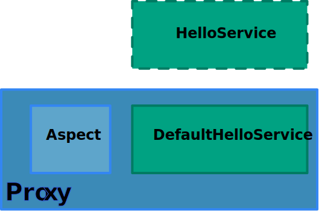

# Spring Core Workshop<br><br><i class="fa fa-leaf" aria-hidden="true"></i>Spring container

<!-- .slide: class="page-title" -->


## Summary

<!-- .slide: class="toc" -->

*   [Introduction](#/1)
*   **[Spring container](#/2)**
*   [Data access](#/3)
*   [Web](#/4)
*   [Spring Boot](#/5)


## Programming model

*   POJO
    *   Business code decoupled from its environment
    *   Beans
*   Environment
    *   Connection, transaction
*   Reuse and testability
*   AOP for cross-cutting concerns
    *   Including technical ones


## Java configuration

*   Assemble the application components
    *   repository, service, datasource, etc.
*   Dependency Injection
*   "Lightweight container" part of Spring


## Java configuration

*    Beans are created and injected with Java
*    Can add logic easily
*    No impact on existing code
*    Type-safe


## Our classes

```java
public class JdbcUserRepository implements UserRepository {

  private final JdbcOperations tpl;

  public JdbcUserRepository(DataSource dataSource) {
    this.tpl = new JdbcTemplate(dataSource);
  }
  (...)
}

public class UserServiceImpl implements UserService {

  private UserRepository userRepository;  // defined setter

  private String digest;  // defined setter

  (...)

  public void init() { (...) } // initialization method
}

```


## Java configuration

```java
@Configuration //Declare configuration class
public class ApplicationConfiguration {

  @Bean public DataSource dataSource() { // Method declaring a bean
    return new EmbeddedDatabaseBuilder()
      .setType(EmbeddedDatabaseType.H2)
      .addScript("classpath:/create-tables.sql")
      .addScript("classpath:/insert-data.sql")
      .build();
  }

  @Bean public UserRepository userRepository() {
    return new JdbcUserRepository(dataSource()); // Dependency Injection
  }

  @Bean public UserService userService() {
    UserServiceImpl userService = new UserServiceImpl();
    userService.setDigest("sha-256");
    userService.setUserRepository(userRepository());
    userService.init(); // call initialization method
    return userService;
  }
}

```


## Java configuration

*   Declaration in multiple classes

```java
@Configuration
@Import({InfraConfiguration.class,ComponentConfiguration.class})
public class ApplicationConfiguration { }
```

*   Avoid big monolithic files
*   Reuse (test, dev, prod)
*   Segregate by layer, module, application vs infrastructure


## Java configuration

*   Create, use, destroy

```java
ConfigurableApplicationContext ctx = new AnnotationConfigApplicationContext(
    ApplicationConfiguration.class
);
UserService userService = ctx.getBean(UserService.class);
String login = "mmouse";
String password = "this is a test";
userService.create(login,password);
ctx.close();
```

*   Scope
    *   Bean is singleton


## Possibilities

*   Object-oriented configuration

```java
@Configuration
public class SpringMvcConfiguration extends WebMvcConfigurationSupport {

	@Override
	protected void addInterceptors(InterceptorRegistry registry) {
		registry.addInterceptor(new MyInterceptor());
	}

}
```


<!-- .slide: class="page-questions" -->


## <i class="fa fa-pencil-square-o" aria-hidden="true"></i> TP : java-configuration-start

*   Java configuration
*   Integration tests


## XML Configuration

*   Legacy way to configure Spring applications
*   Assemble application components
    *   Repository, service, datasource, etc.
*   DI
*   "Lightweight container" part of Spring


## Our classes

```java
public class JdbcUserRepository implements UserRepository {

  private final JdbcOperations tpl;

  public JdbcUserRepository(DataSource dataSource) {
    this.tpl = new JdbcTemplate(dataSource);
  }
  (...)
}

public class UserServiceImpl implements UserService {

  private UserRepository userRepository;  // defined setter

  private String digest;  // defined setter

  (...)

  public void init() { (...) } // initialization method
}

```


## XML Configuration

```xml
<bean id="userRepository" class="c.z.repository.jdbc.JdbcUserRepository">
  <constructor-arg ref="dataSource" />
</bean>

<bean id="userService" class="c.z.business.impl.UserServiceImpl"
      init-method="init">
  <property name="digest" value="sha-256" />
  <property name="userRepository" ref="userRepository" />
</bean>
```


## XML Configuration

```xml
<bean id="userRepository" class="c.z.repository.jdbc.JdbcUserRepository">
  <constructor-arg ref="dataSource" />
</bean>
```

*   'id' to reference it later
*   'class' attribute for the implementation
*   Constructor dependency injection
*   Reference to another bean
    *   `Ref` attribute
    *   `dataSource` definition explained later


## XML Configuration

```xml
<bean id="userService" class="c.z.business.impl.UserServiceImpl"
      init-method="init">
  <property name="digest" value="sha-256" />
  <property name="userRepository" ref="userRepository" />
</bean>
```

*   Spring calls initialization method
    *   `init-method` attribute
*   Setter injection
    *   Scalar value: `value` attribute
    *   Spring bean: `ref` attribute


## XML Configuration

*   File header

```xml
<?xml version="1.0" encoding="UTF-8"?>
<beans xmlns="http://www.springframework.org/schema/beans"
      xmlns:xsi="http://www.w3.org/2001/XMLSchema-instance"
       xsi:schemaLocation="http://www.springframework.org/schema/beans
         http://www.springframework.org/schema/beans/spring-beans.xsd">
 (...)
</beans>
```

*   Copy/paste, or use IDE feature


## XML Configuration

*   DataSource

```xml
<jdbc:embedded-database id="dataSource" type="H2">
  <jdbc:script location="classpath:/create-tables.sql" />
  <jdbc:script location="classpath:/insert-data.sql" />
</jdbc:embedded-database>
```

*   Dedicated namespace for embedded database`
*   Hides a ben declaration
    *   "abstraction" over `<bean />`


## XML Configuration

*   Namespace declaration

```xml
<?xml version="1.0" encoding="UTF-8"?>
<beans xmlns="http://www.springframework.org/schema/beans"
        xmlns:xsi="http://www.w3.org/2001/XMLSchema-instance"
        xmlns:jdbc="http://www.springframework.org/schema/jdbc"
        xsi:schemaLocation="http://www.springframework.org/schema/beans
          http://www.springframework.org/schema/beans/spring-beans.xsd
          http://www.springframework.org/schema/jdbc
          http://www.springframework.org/schema/jdbc/spring-jdbc.xsd">

  (...)

</beans>
```


## XML Configuration

*   Declare beans across multiple files

```xml
<import resource="classpath:/application-components.xml" />
<import resource="classpath:/test-datasource.xml" />
```
*   Avoid big monolithic files
*   Reuse (test, dev, prod)
*   Segregate by layer, module, application vs infrastructure


## XML Configuration

*   Creation, usage, destruction

```xml
ConfigurableApplicationContext ctx = new ClassPathXmlApplicationContext(
  "classpath:/test-application-configuration.xml"
);
UserService userService = ctx.getBean(UserService.class);
String login = "mmouse";
String password = "this is a test";
userService.create(login,password);
ctx.close();
```
*   Scope
    *   Bean is a singleton


<!-- .slide: class="page-questions" -->


## <i class="fa fa-pencil-square-o" aria-hidden="true"></i> TP : xml-configuration-start

*   XML Configuration across multiple files
*   Integration tests


## Annotation-based configuration

*   Alternative to XML configuration and Java configuration (can mix and match...)
*   Most used way to configure Spring applications
*   Directly annotate classes with configuration instructions
    *   Intrusive
*   Type-safe
*   Fast and efficient
    *   Modify code and configuration in the same place
*   More rigid
    *   Hardcoded configuration in the code
    *   Can only annotate your own code


## Bean declaration

*   Annotation the implementaion with:
    *   `@Component` (most generic)
    *   `@Service`
    *   `@Repository`
    *   `@Controller`
*   Similar behavior (only specify a stereotype)


## Bean declaration

```java
@Repository
public class JdbcUserRepository implements UserRepository {
 (...)
}

@Service
public class UserServiceImpl implements UserService {
  (...)
}
```


## Detect annotated classes

*   "Component scannning"
*   Package and sub-packages

```java
@Configuration
@ComponentScan("com.zenika")
public class ComponentsConfiguration { }
```
*   XML
    *   Import "context" namespace

```xml
<context:component-scan base-package="com.zenika" />
```


## Dependency Injection

*   Use `@Autowired`
*   On constructors, fields or methods (setters)

```java
@Autowired
public JdbcUserRepository(DataSource dataSource) { } // constructor

@Autowired
private UserRepository userRepository; // field
```


## @Autowired

*   Resolution by type, mandatory dependency
*   In case of ambiguity, resolve by name using `@Qualifier`
*   Ambiguities are typically rare
*   Fall back to Java/XML configuration when dependencies become hard to follow using annotations


## Autowiring: Java configuration

*   `@Autowired` also works between Java configuration classes

```java
@Configuration // configuration class
public class ComponentConfiguration {

	@Autowired DataSource dataSource; //declared in another configuration class

	@Bean public UserRepository userRepository() {
		return new JdbcUserRepository(dataSource);
	}

	@Bean public UserService userService() {
       ...
	}

}
```


## Injection of scalar values

*   Use `@Value`
*   Usually comes from properties
    *   `MessageSource` in Spring-speak
    *   Syntax: `${propertyName}`
*   Value can be a SpEL expression
    *   Spring Expression Language
    *   Syntaxe : `#{spelExpression}`


## Injection of scalar values

```java
@Value("${digest}")
private String digest;
```

```java
@Configuration
public class TestConfiguration {

  @Bean
  public static PropertySourcesPlaceholderConfigurer properties() {
    PropertySourcesPlaceholderConfigurer propertySourcesPlaceholderConfigurer =
      new PropertySourcesPlaceholderConfigurer();
    Properties properties = new Properties();
    properties.setProperty("digest", "sha-256");
    propertySourcesPlaceholderConfigurer.setProperties(properties);
    return propertySourcesPlaceholderConfigurer;
  }

}
```


## Cohabitation with Java / XML

*   Can mix different configuration styles
*   Typical usage
    *   Annotations for your application classes
    *   Java/XML for infrastructure


## Initialization callback

```java
@PostConstruct
public void init() {
  (...)
}
```

*   Works if component-scan is enabled
    *   Otherwise `@PostConstruct` is not detected


## More on testing

```java
public class ApplicationIntegrationTest {

  private ConfigurableApplicationContext ctx;

  private UserService userService;

  @Before public void setUp() { // cumbersome creation / destruction
    ctx = new ClassPathXmlApplicationContext(
      "classpath:/test-application-configuration.xml"
    );
    userService = ctx.getBean(UserService.class);
  }

  @After public void tearDown() {
    ctx.close();
  }
  (...)
}
```


## More on testing

```java
@RunWith(SpringRunner.class)
@ContextConfiguration(classes=TestConfiguration.class)
public class ApplicationIntegrationTest {

  @Autowired UserService userService;
  (...)
}
```

*   TestContext Framework
*   Avoid manual creation of application context
*   Context is cached and reused in a test suite
    *   Started by Ant, Maven, Gradle, etc.


<!-- .slide: class="page-questions" -->


## <i class="fa fa-pencil-square-o" aria-hidden="true"></i> TP : annotation-configuration-start

*   Configuration with annotations
    *   Injection, scalar values, initialization callback
*   Test using TestContext Framework


## AOP

*   Aspect-Oriented Programming
*   Complements Spring's POJO model
*   How do you integrate cross-cutting concerns in your simple POJOs?
    *   Connections, transactions, caching, security, log, etc.


## AOP goals

*   Goes along with object-oriented programming
*   Modularize cross-cutting concerns
    *   Transactions, log, etc.
*   So that they do not show up in application code
*   Decoupling with environment
*   "Separation of concerns"


## Without AOP?

*   Application code tangled with technical code
    *   Less testable, less maintainable
*   Technical code scattered across the application
    *   Less maintainable, less flexible


## AOP mechanism in Spring

*   Intercept application code
*   Use proxies

<figure>
    
</figure>


## Proxy JDK

```java
// Target service
final HelloService targetService = new DefaultHelloService();

InvocationHandler handler = new InvocationHandler() {

  @Override
  public Object invoke(Object proxy, Method method, Object[] args) throws Throwable {
    // Call the target service
    Object res = method.invoke(targetService, args);
    return res;
  }
};
HelloService decoratedHelloService = (HelloService) Proxy.newProxyInstance(
  getClass().getClassLoader(),
  new Class<?>[]{HelloService.class},
  handler
);
decoratedHelloService.hello();
```


## AOP in Spring

*   Spring relies on JDK proxies
    *   Thanks to AspectJ (Pointcut)
*   Configuration with annotation
*   Choice of intercepted methods
*   Can intercept
    *   Before, after, arounf a method
    *   When an exceptions has been thrown


## Aspect

```java
@Aspect // Identify the class as an Aspect
public class LogAspect {

  (...)

  // Advice = the called method
  // Type of advice: before / after / after throwing / after returning / around
  // Pointcut expression
  @Around("execution(* com.zenika.business.*.*(..))")
  public Object log(ProceedingJoinPoint jp) throws Throwable {
    LOGGER.info("Calling {}",jp.getSignature().toShortString());
    Object res = jp.proceed(); // Appel de la méthode interceptée
    LOGGER.info("Calling done");
    return res;
  }

}
```


## Activate aspects

*   Usually, on a dedicated class

```java
@Configuration
@EnableAspectJAutoProxy
public class AopConfiguration {

    @Bean public LogAspect logAspect() {
        return new LogAspect();
    }

}
```


<!-- .slide: class="page-questions" -->


## <i class="fa fa-pencil-square-o" aria-hidden="true"></i> TP : aop-start

*   Configuration and activation of an aspect
*   Integration test


## Test

*   Decoupled with the infrastructure
*   Better testability
*   "Separation of concerns"


## Business service

```java
public class UserServiceImpl implements UserService {
  (...)
  public User authenticate(String login, String password) {
    User user = userRepository.getByLogin(login);
    if(user == null) {
      return null;
    } else {
      if(password == null) {
        throw new IllegalArgumentException("Password can't be null");
      }
      password = encoder.encode(password);
      if(password.equals(user.getPassword())) {
        return user;
      } else {
        return null;
      }
    }
  }
}
```

<i class="fa fa-arrow-right"></i> How to do integration testing without a database?


## Unit test

*   Test in complete isolation
*   Simulate dependencies
    *   Stub (dummy implementation)
    *   Mock (dictate runtime behavior)
*   Spring not involved (Spring is itself a dependency...)


## Mockito

```java
public class UserServiceImplTest {

  private UserRepository userRepository;

  private UserServiceImpl userService;

  @Before public void setUp() {
    // Create a mock
    userRepository = mock(UserRepository.class);
    userService = new UserServiceImpl();
    userService.setUserRepository(userRepository);
    userService.init();
  }

  @Test public void getByLoginNoUser() {
    String login = "test";
    // defined behavior
    when(userRepository.getByLogin(login)).thenReturn(null);
    Assert.assertNull(userService.authenticate(login, ""));
    // verify that the call has been made
    verify(userRepository).getByLogin(login);
  }
}
```


<!-- .slide: class="page-questions" -->


## <i class="fa fa-pencil-square-o" aria-hidden="true"></i> TP : unit-test-start

*   Test a service using Mockito
